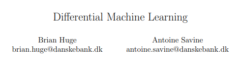

# Differential Deep Learning

* TOC
{:toc}

## Training with Derivatives

  

## Application on Black-Scholes Example

### Supervised Learning as Benchmark

### Supervised Learning with Differential Machine Learning

## Demo on Gradio

## References